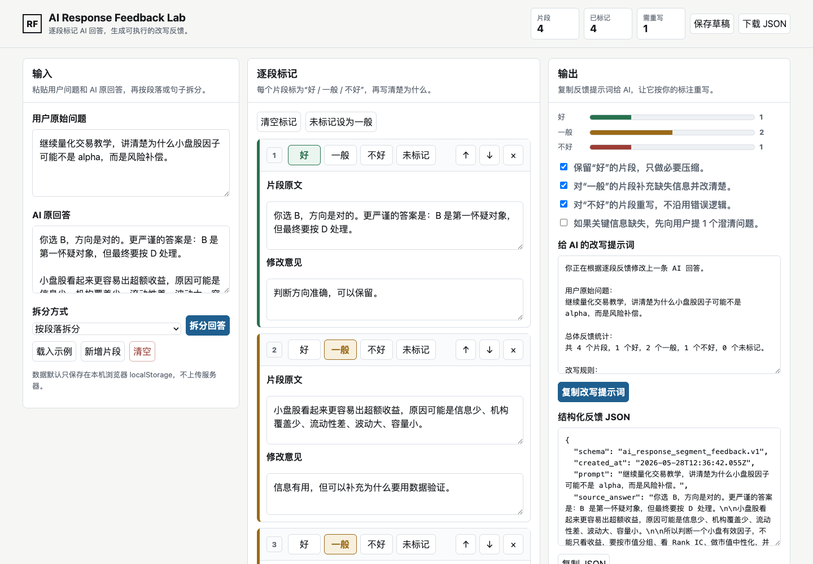

# AI Response Feedback Lab

Segment-level feedback tool for AI answers.

Paste an AI response, split it into smaller parts, mark each part as:

- good,
- okay,
- bad,

then generate a structured revision prompt that can be sent back to an AI model.

## Why This Exists

AI feedback is usually too coarse:

- "This answer is bad."
- "Make it clearer."
- "Try again."

That does not tell the model which part should be kept, improved, or replaced.
This project turns feedback into a usable structure:

```text
response -> segments -> label each segment -> revision prompt -> improved answer
```

The goal is to make AI conversations more controllable and to accumulate useful
human preference data over time.



## Current MVP

The current version is a static web app:

- paste the original user prompt,
- paste the AI answer,
- split by paragraph or sentence,
- label each segment as good / okay / bad,
- add notes for each segment,
- generate a revision prompt,
- export structured JSON,
- import structured JSON,
- store drafts and named history locally in browser localStorage.

No backend is required. No API key is required.

## Use Locally

Open:

```text
index.html
```

Or serve the folder:

```bash
python3 -m http.server 8787
```

Then open:

```text
http://127.0.0.1:8787/
```

## Browser Extension

The `extension/` folder contains a Manifest V3 browser extension. It injects the
feedback UI directly into supported AI chat pages:

- ChatGPT,
- Claude,
- Gemini,
- Microsoft Copilot.

Local install:

1. Open `chrome://extensions`.
2. Enable Developer mode.
3. Click "Load unpacked".
4. Select the `extension/` folder.
5. Open an AI chat page and click "标记回答" under an assistant response.

If automatic message detection fails, select the answer text and click the
bottom-right "RF 标记" button.

## Output Schema

The exported JSON uses this rough schema:

```json
{
  "schema": "ai_response_segment_feedback.v1",
  "prompt": "User question",
  "source_answer": "Original AI answer",
  "split_mode": "paragraph",
  "summary": {
    "total": 4,
    "rated": 4,
    "good": 1,
    "ok": 2,
    "bad": 1
  },
  "segments": [
    {
      "index": 1,
      "text": "Segment text",
      "rating": "good",
      "label": "好",
      "note": "Keep this reasoning."
    }
  ],
  "revision_prompt": "Prompt to send back to the AI model"
}
```

## Product Direction

Short-term:

- add keyboard shortcuts,
- add side-by-side original and revised answers,
- add browser extension mode for ChatGPT / Claude / Gemini pages,
- add dataset export for evaluation.

Medium-term:

- integrate model APIs so the app can rewrite directly,
- support pairwise comparison between two answers,
- support team review workflows,
- create feedback dashboards for recurring model mistakes.

Long-term:

- become a lightweight RLHF-style annotation tool for individuals and small
  teams who want better AI answers without running a full labeling platform.

## Ethical Use

This tool should be used to improve clarity, accuracy, reasoning, and usefulness.
It should not be used to manipulate reviews, fake engagement, or create deceptive
AI output.
